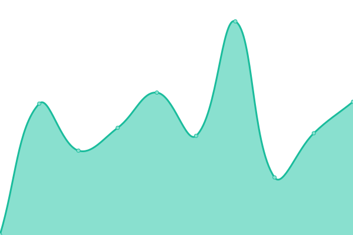

# [📈 Live Status](https://monitor.hostnoc.com): <!--live status--> **🟩 All systems operational**

This repository contains the open-source uptime monitor and status page for [hostingnocteam](https://monitor.hostnoc.com), powered by [Upptime](https://github.com/upptime/upptime).

With [Upptime](https://upptime.js.org), you can get your own unlimited and free uptime monitor and status page, powered entirely by a GitHub repository. We use [Issues](https://github.com/hostingnocteam/monitoring/issues) as incident reports, [Actions](https://github.com/hostingnocteam/monitoring/actions) as uptime monitors, and [Pages](https://monitor.hostnoc.com) for the status page.

<!--start: status pages-->
<!-- This summary is generated by Upptime (https://github.com/upptime/upptime) -->
<!-- Do not edit this manually, your changes will be overwritten -->
<!-- prettier-ignore -->
| URL | Status | History | Response Time | Uptime |
| --- | ------ | ------- | ------------- | ------ |
|  [HostNoc](https://www.hostnoc.com) | 🟩 Up | [host-noc.yml](https://github.com/hostingnocteam/monitoring/commits/HEAD/history/host-noc.yml) | 

 766ms
     
 | 

<a href="https://monitor.hostnoc.com/history/host-noc">100.00%</a>
    

|  [AntiDos](https://antidos.com) | 🟩 Up | [anti-dos.yml](https://github.com/hostingnocteam/monitoring/commits/HEAD/history/anti-dos.yml) | 

 352ms
     
 | 

<a href="https://monitor.hostnoc.com/history/anti-dos">99.09%</a>
    

|  [Branex](https://branex.com) | 🟩 Up | [branex.yml](https://github.com/hostingnocteam/monitoring/commits/HEAD/history/branex.yml) | 

 292ms
     
 | 

<a href="https://monitor.hostnoc.com/history/branex">99.09%</a>
    

|  [Branex AE](https://branex.ae) | 🟩 Up | [branex-ae.yml](https://github.com/hostingnocteam/monitoring/commits/HEAD/history/branex-ae.yml) | 

 361ms
     
 | 

<a href="https://monitor.hostnoc.com/history/branex-ae">99.09%</a>
    

|  [Branex UK](https://branex.co.uk) | 🟩 Up | [branex-uk.yml](https://github.com/hostingnocteam/monitoring/commits/HEAD/history/branex-uk.yml) | 

 249ms
     
 | 

<a href="https://monitor.hostnoc.com/history/branex-uk">98.80%</a>
    

|  [Storage Server](185.215.165.37) | 🟩 Up | [storage-server.yml](https://github.com/hostingnocteam/monitoring/commits/HEAD/history/storage-server.yml) | 

 114ms
     
 | 

<a href="https://monitor.hostnoc.com/history/storage-server">100.00%</a>
    

|  [HostNoc Server](75.119.137.149) | 🟩 Up | [host-noc-server.yml](https://github.com/hostingnocteam/monitoring/commits/HEAD/history/host-noc-server.yml) | 

 107ms
     
 | 

<a href="https://monitor.hostnoc.com/history/host-noc-server">100.00%</a>
    

<!--end: status pages-->

[**Visit our status website →**](https://monitor.hostnoc.com)

## 📄 License

- Powered by: [Upptime](https://github.com/upptime/upptime)
- Code: [MIT](./LICENSE) © [Anand Chowdhary](https://anandchowdhary.com), supported by [Pabio](https://pabio.com)
- Data in the `./history` directory: [Open Database License](https://opendatacommons.org/licenses/odbl/1-0/)
